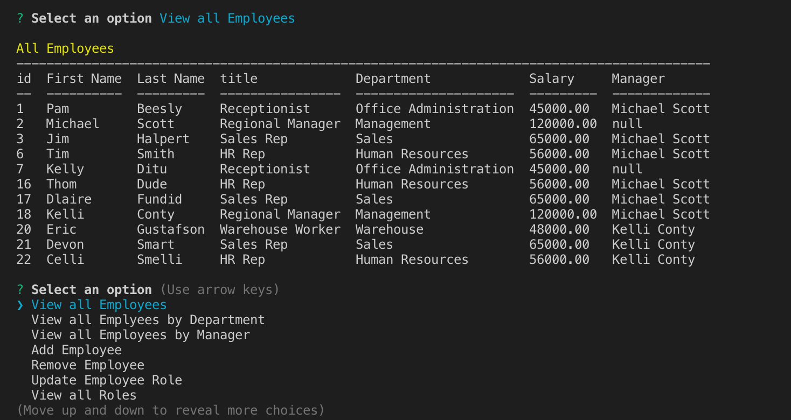

# Employee-Tracker

A solution for managing a company's employees using node, inquirer, and MySQL
* The command-line application allows users to:

  * Add departments, roles, employees
  * View departments, roles, employees
  * Update employee roles
  * View employees by manager
  * Delete departments, roles, employees

# Visuals


# Usage

1. Use the CLI interface to select employee management options
2. Menu options lead to additional prompts
3. Options return to the home menu.
4. Select the next option as needed.
5. Use the Exit option to close the application.

# Steps to Setup
1. Clone the repo

2. Install dependencies

```bash
npm install
```

3. Create the database using the officeSchema.sql and seeds.sql files.


4. Run Server

```bash
node server.js
```


# What I Learned

* SQL queries for Create, Read, Update, and Delete (CRUD)
* Using NPM mysql module to interact with a MySQL backend
* Creating SQL schema and seed files

# Links to Project

##### GitHub
[employee-tracker](https://github.com/niroshanwitharana/Employee-Tracker)
